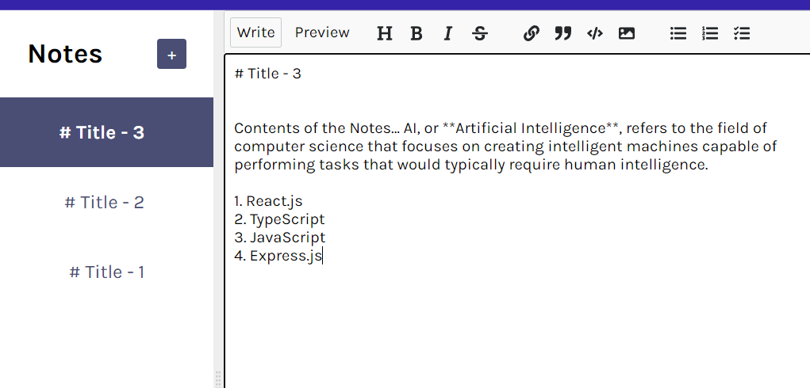

# Notes-App with Firebase

## => This Notes React app is a user-friendly and efficient note-taking application. Backend of this React-App is linked with Firebase, so your Notes will not be lost.

## Website Link => https://notes-app-mk.vercel.app/

## Project's Screenshots =>



<h2>Getting Started</h2>

1. To get started with this project, you will need to have `Node.js` and `NPM` installed on your system.

2. First, you need to open a `Terminal` in your system and `Clone` this repository by using :

```bash
git clone https://github.com/Mk4Levi/Notes-App-with-Firebase.git
```

3. Navigate to the Project's directory :

```bash
cd Notes-App-with-Firebase
```

4. Install all Dependencies used in this Project :

```bash
npm install
```

5. Finally, host it on local server :

```bash
npm run dev
```

6. Now just search this link in your browser to view the live running application in your Local sysytem :

```bash
http://localhost:5173
```

<h2>Paths & Files</h2>

### Structure of the Folders & Files in this Repo :

```text
.
├── public/
├── src
│   ├── assets/
│   ├── components/
│         └── Editor.jsx
│         └── Sidebar.jsx
│         └── index.js
│
│   ├──  css/
│         └──style.css
|
│   ├── App.jsx
│   ├── index.jsx
│   ├── vercel.json
│
├── .eslintrc.json
├── .gitattributes
├── .gitignore
├── index.html
├── package-lock.json
├── package.json
├── README.md
├── vite.config.js

```

# Thank You
